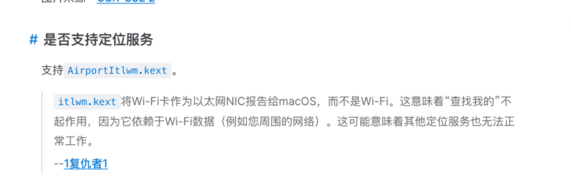
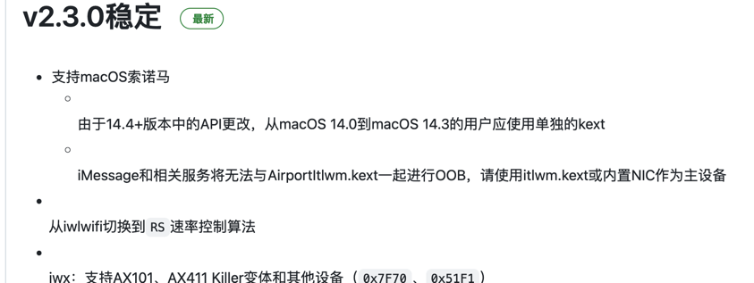
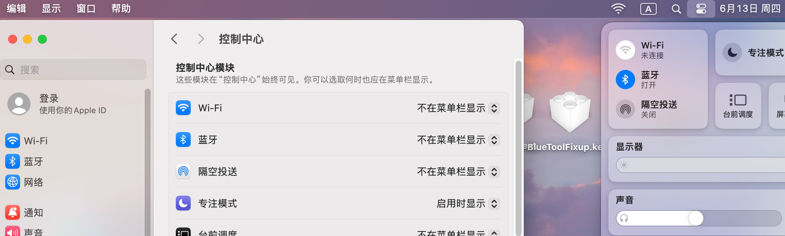
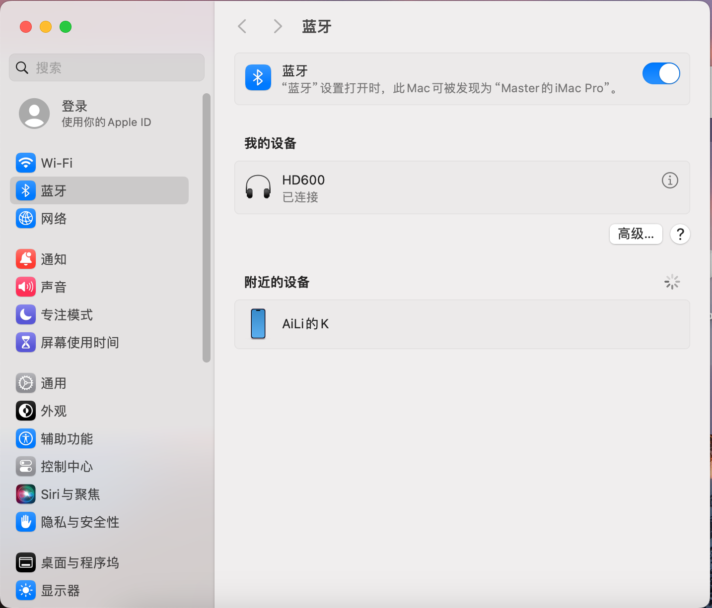

# Hackintosh-MAXSUN铭瑄挑战者-B660M-12400F

适用于 12400 + 铭瑄B660M 黑苹果引导文件

基于 OpenCore版本，机型 MacPro 7,1，系统 MacOS 14.5

# 本机配置

| 配置        | 型号               |
| ----------- | ------------------ |
| CPU         | intel i5 12400     |
| 主板        | 铭瑄终结者 B660M   |
| 显卡        | 蓝宝石 580         |
| 内存        | 3200MHz 8G * 2     |
| SSD         | 西部数据sn770 500G |
| WiFi + 蓝牙 | Intel ax201        |

# 正常驱动
* 声卡完美驱动
* USB接口正常
* 音量调节正常
* 有线无线网卡正常
* 睡眠唤醒正常

# 注意事项
1. 通常来说🙆同型号主板接口是一样的，我已经做了接口定制如果发现无法使用USB、蓝牙等情况就需要 自己去做USB接口定制了 🤗     
   [国光-USB定制教程](https://apple.sqlsec.com/6-%E5%AE%9E%E7%94%A8%E5%A7%BF%E5%8A%BF/6-1/)
2. 网卡方面没有使用免驱卡，使用的[itlwm](https://github.com/OpenIntelWireless/itlwm)，这个作者还有另一种方案AirportItlwm需要配合软件[HeliPort](https://openintelwireless.github.io/HeliPort/)使用，因为原理就是将网卡模拟到以太网，所以系统界面的WIFI开关无效。你可以把HeliPort加入登陆项，这样开机即用啦🤗，缺点就是因为imac本身也没有GPS，也没有使用系统WIFI导致，会无法获取定位，那么基于系统定位的天气什么的就不行了🥺。另外如果自己去弄这个要很小心，因为大多数教程都是旧mac的系统，14系统安装的时候有点不同，我忘记哪里看的文档了，大意就是14以上的系统某些文件不需要安装

3. 蓝牙用的是[IntelBluetoothFirmware](https://github.com/OpenIntelWireless/IntelBluetoothFirmware)，蓝牙可以支持系统开关，直接使用这些没问题😄
4. 显卡是免驱动的蓝宝石-RX580就没啥好说，就是部分品牌580显卡太旧了不支持UEFI启动，也可能是矿卡刷了其他的vbios。
5. 不知道哪里下载镜像？我的镜像是[悦享博客](https://yuexiang.fun/)提供的，非常好的作者，也很辛苦上传了很多网盘🥹，请多多支持。
# 项目展示

